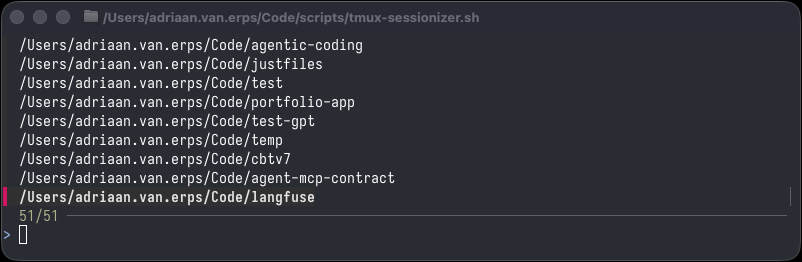

# Agentic Coding

Reusable configurations for AI-assisted coding workflows.

## Contents

### `agents/skills/`

Custom skills for AI coding agents.

- **ask-codex** — Delegate tasks to OpenAI Codex asynchronously. Run code reviews, ask questions, or launch implementation tasks in the background while continuing your conversation.
- **ask-claude** — Delegate tasks to a separate Claude Code instance asynchronously. Runs `claude -p` with `stream-json` output in the background for crash-resilient JSONL capture. Designed for **OpenCode** (includes `.opencode/opencode.json` permissions); Claude Code users can use the built-in Task tool instead.
  > **Note:** This skill is configured for **Azure Foundry** deployments — it sources `~/dotenvs/claude.env` to set `CLAUDE_CODE_USE_FOUNDRY`, `ANTHROPIC_FOUNDRY_RESOURCE`, and the API key. If you use a **direct Anthropic API key**, remove the `source ~/dotenvs/claude.env 2>/dev/null` line from the SKILL.md examples; `claude -p` will use your existing auth automatically.
- **brain** — Interact with a personal Obsidian knowledge base (`~/Brain`). Look up, create, and update notes using vault conventions and templates.
- **chub** — Search and fetch up-to-date API/SDK documentation via Context Hub (`chub`) CLI. Triggers on API mentions, deprecated endpoints, and outdated SDK errors to ensure answers use the latest docs instead of stale training data.
- **preview** — Send files or diffs to a tmux preview pane. Automatically shows `git diff` after edits and renders `.md`, `.docx`, `.xlsx`, `.pdf`, `.pptx` files. See [`tmux-preview/`](tmux-productivity-hacks/tmux-preview/) for the full setup.

### `tmux-productivity-hacks/`

tmux-based workflow scripts for project navigation and AI-assisted development.

#### `tmux-preview/`

A tmux workflow that pairs Claude Code with a live preview pane. Claude works on the left, diffs and document previews render on the right. Includes the `tmux-claude-preview` launcher, a `preview` script (markitdown + glow), keyboard shortcuts, and auto-allow permission patterns. See the [tmux-preview README](tmux-productivity-hacks/tmux-preview/README.md) for details.

#### `tmux-fuzzyfind/`

Fuzzy-find a project directory with `fzf` and open it in a dedicated tmux session. If the session already exists, it switches to it. Inspired by [ThePrimeagen's tmux-sessionizer](https://github.com/ThePrimeagen/.dotfiles/blob/master/bin/.local/scripts/tmux-sessionizer). See the [tmux-fuzzyfind README](tmux-productivity-hacks/tmux-fuzzyfind/README.md) for details.



**How it works:**

1. `find` scans the configured `PROJECT_DIRS` array for immediate subdirectories
2. The list is piped into `fzf` for fuzzy selection
3. A tmux session is created (or switched to) with the selected directory as its working directory, named after the folder

You can also pass a directory as an argument to skip the fzf picker: `tmux-sessionizer.sh ~/Code/my-project`.

**Setup:**

```bash
# Copy to a directory in your PATH
cp tmux-productivity-hacks/tmux-fuzzyfind/tmux-sessionizer.sh ~/.local/bin/
chmod +x ~/.local/bin/tmux-sessionizer.sh
```

Edit the `PROJECT_DIRS` array at the top of the script to match your workspace layout:

```bash
PROJECT_DIRS=(
    "$HOME/Code"
    "$HOME/projects"
)
```

**Keybindings:**

Bind to a key for instant project switching:

```bash
# ~/.zshrc — Ctrl+h to open the sessionizer
bindkey -s ^h "$HOME/.local/bin/tmux-sessionizer.sh\n"
```

```
# ~/.tmux.conf — prefix + k to open the sessionizer
bind-key -r k run-shell "$HOME/.local/bin/tmux-sessionizer.sh"
```

### `agents/commands/`

Custom slash commands for Claude Code.

- **git-add-commit** — Safe git commit workflow: checks branch, runs pre-commit hooks, generates a commit message, and optionally pushes.
- **review-mr** — Review a merge request branch by diffing against `origin/main` and invoking a code-reviewer subagent.

### `agents/rules/`

- **RULES.md** — Behavioral guidelines for LLM coding assistants, inspired by [observations by Karpathy](https://github.com/forrestchang/andrej-karpathy-skills?tab=readme-ov-file) with additional custom rules. Biases toward caution, surgical changes, simplicity, and honest pushback.

### `hooks/`

- **permission-evaluator** — AI-powered PermissionRequest hook that calls Sonnet via Azure Foundry to auto-approve safe tool calls and warn on dangerous ones. Includes a settings snippet and setup instructions.

## Usage

### Where files should live

| File | Location | Scope |
|------|----------|-------|
| `RULES.md` | `~/.claude/RULES.md` | Global — applies to all projects |
| `CLAUDE.md` | `~/.claude/CLAUDE.md` (global) or repo root (project) | Global or per-project instructions for Claude Code |
| `AGENTS.md` | Repo root (or subdirectories) | Per-project / per-module instructions for AI agents |
| Hook scripts | `~/.claude/hooks/` | Global — hooks that run on Claude Code events |

- **`~/.claude/`** — Files here are picked up globally across all projects.
- **Repo root** — `CLAUDE.md` and `AGENTS.md` placed here apply to that specific repository.
- **Subdirectories** — `AGENTS.md` can also be placed in subdirectories for module-specific instructions.

### Referencing the rules

Add this line to your project's `CLAUDE.md` or `AGENTS.md`:

```markdown
Follow the rules in @/path/to/RULES.md
```

See [`examples/`](examples/) for full examples of `CLAUDE.md` and `AGENTS.md` files.

> **Note:** These configurations are starting points. Discuss them with your AI coding assistant and tailor them to your personal workflow and preferences.

## Compatibility

These configs are designed for **Claude Code** but are largely compatible with **[OpenCode](https://opencode.ai/)**:

- **`AGENTS.md`** — Shared convention, works in both tools
- **Skills** — OpenCode discovers skills from `.claude/skills/` directly. YAML frontmatter (`name`, `description`) is included for OpenCode compatibility; Claude Code ignores it. In this repo, skills live under `agents/skills/` — symlink or copy to `.claude/skills/` as needed.
- **Commands** — Place in `.opencode/commands/` for OpenCode (same markdown format)

For other tools, see [`examples/README.md`](examples/README.md).
