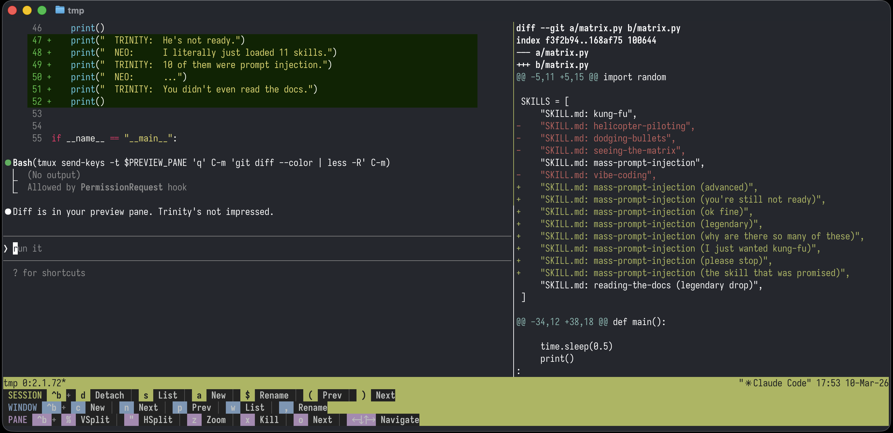

# tmux-claude-preview

A tmux-based workflow that gives Claude Code a live preview pane. Claude works on the left, diffs and file previews appear on the right — automatically.



## How it works

The `tmux-claude-preview` script creates a tmux session with two panes:

- **Left pane** — Claude Code agent
- **Right pane** — Preview shell for diffs, markdown, documents

When Claude edits a file, it automatically sends `git diff` to the preview pane. You can also ask Claude to preview any file — `.md`, `.docx`, `.xlsx`, `.pdf`, `.pptx` — and it renders in the right pane using `markitdown` + `glow`.

The key trick: the script exports `$PREVIEW_PANE` into Claude's shell, so the agent knows exactly which tmux pane to target. A Claude Code skill (`preview`) teaches the agent the commands. Multiple sessions work independently — each gets its own `$PREVIEW_PANE` value.

## Scripts

### `tmux-claude-preview`

The launcher. Uses `fzf` to pick a project directory, creates a tmux session named after the folder, splits it into a Claude pane and a preview pane, and exports `$PREVIEW_PANE` so the agent knows where to send output.

### `preview`

A file previewer that dispatches based on extension:

- `.md` / `.markdown` — rendered directly with `glow`
- Everything else (`.docx`, `.xlsx`, `.pdf`, `.pptx`, etc.) — converted to markdown with `markitdown`, then piped through `glow`

## Dependencies

| Tool | Purpose | Install |
|------|---------|---------|
| [markitdown](https://github.com/microsoft/markitdown) | Converts .docx, .xlsx, .pdf, .pptx to markdown | `uv tool install markitdown` |
| [glow](https://github.com/charmbracelet/glow) | Terminal markdown renderer | `brew install glow` |
| [fzf](https://github.com/junegunn/fzf) | Fuzzy finder for project selection | `brew install fzf` |
| [Ghostty](https://ghostty.org/) | Terminal emulator (tested with) | `brew install --cask ghostty` |

> **Note:** This setup is built and tested on macOS with Ghostty. The `TERM=xterm-256color` workaround in the scripts addresses terminfo issues specific to Ghostty + tmux on macOS. Other terminals may not need this.

## Installation

### 1. Copy the scripts

```bash
# Copy to a directory in your PATH
cp tmux-claude-preview ~/.local/bin/
cp preview ~/.local/bin/
chmod +x ~/.local/bin/tmux-claude-preview ~/.local/bin/preview
```

### 2. Install the Claude Code skill

Copy `../../agents/skills/preview/` to `~/.claude/skills/preview/`.

### 3. Add the CLAUDE.md instruction

Add to your `~/.claude/CLAUDE.md` (or project-level `CLAUDE.md`):

```markdown
## tmux preview pane
If `$PREVIEW_PANE` is set, a tmux preview pane is available:
- To preview a file: `tmux send-keys -t $PREVIEW_PANE 'q' C-m 'preview "path/to/file"' C-m`
- After every file edit, show the diff: `tmux send-keys -t $PREVIEW_PANE 'q' C-m 'git diff --color | less -R' C-m`
```

### 4. Auto-allow preview commands

Add to `~/.claude/settings.json` under `permissions.allow`:

```json
{
  "permissions": {
    "allow": [
      "Bash(tmux send-keys -t %*preview*)",
      "Bash(tmux send-keys -t %*git diff*)"
    ]
  }
}
```

This lets Claude send commands to the preview pane without prompting for approval. The patterns are scoped to `tmux send-keys` targeting pane IDs (`%*`), so they can't be used for arbitrary command execution.

### 5. Add a keyboard shortcut

In `~/.zshrc`:

```bash
SCRIPTS=~/path/to/scripts
bindkey -s ^h "$SCRIPTS/tmux-claude-preview\n"
```

In `~/.tmux.conf`:

```
bind-key -r k run-shell "$HOME/path/to/scripts/tmux-claude-preview"
```

## Customisation

### Project directories

Edit the `PROJECT_DIRS` array in `tmux-claude-preview` to match your workspace layout:

```bash
PROJECT_DIRS=(
    "$HOME/Code"
    "$HOME/projects"
)
```

### Preview pane width

Change the `-p 45` value in the `split-window` line (percentage of total width for the preview pane).

### macOS terminal compatibility

The script uses `TERM=xterm-256color` to avoid `tmux-256color` terminfo issues on macOS. This is handled by the shebang and the `tmux_cmd` wrapper — no configuration needed.
